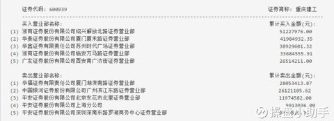
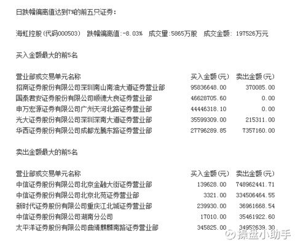

# 龙虎榜数据分析
## 龙虎榜数据特点
    1、龙虎榜是交易所发布的，不是证监会发布的上交所$ 上证指数 ( SH000001 ) $ ，深交所$ 深证成指 ( SZ399001 ) $  每天收盘后发布，具体时间不太确定，大概是 16 点到 20 点之间，一般深交所发布的比上交所要早一些。龙虎榜数据是上交所和深交所每天在收盘后发布的交易异常的股票，对于同一个上榜理由，上交所只发布前 
    
    2、深交所发布的龙虎榜数据比上交所多对于同一个上榜理由，上交所只发布前 3 名。以振幅为例，' 日振幅达到 15% 的前 3 只证券 ' ——所以，沪市的股票即便振幅超过 15% 也未必能上龙虎榜，还得是振幅最大的 3 只。深市则把股票分为主板、中小板、创业板，发布每个板块满足条件的前 5 名。例如，主板 ' 日振幅达到 15% 的前 5 只证券 '、中小板 ' 日振幅达到 15% 的前 5 只证券 '、创业板 ' 日振幅达到 15% 的前 5 只证券 '。

    3、深交所发布的龙虎榜数据比上交所详细上交所对于买入前五的营业部，只公布其买入金额；对于卖出前五的营业部，只公布其卖出金额。因此，卖出的营业部不一定没买入，只是他没进入买入金额的前 5 名，买入的营业部不一定没卖出，只是他没进入卖出金额的前 5 名。
上海交易所发的龙虎榜

深证交易所发的龙虎榜

综上所述，研究深圳交易所的龙虎榜数据更加有意义，原因：
* 深圳的龙虎榜数量相对将多
* 深圳的龙虎榜公布的营业部的数据相对较多，买卖双方的都公布出来了

## 程序
* init_Data_longhubang.py:收集数据
* statistics_model.py :处理数据
    * 把今年上榜次数超过200次的营业部找到，结果保存到sort_exalter.csv
    * 将他们今年的交易记录提取出来，结果保存到DealDetail.csv
    * 剔除上海交易所的龙虎榜股票(由于接口数据的限制好像不用剔除)
    * 
    

